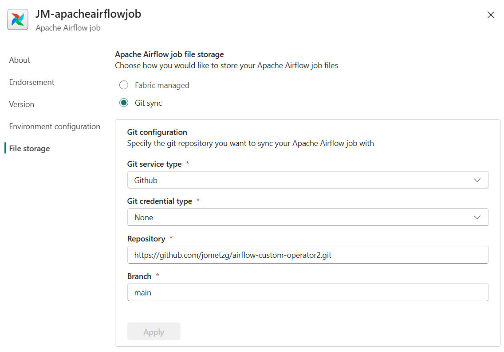
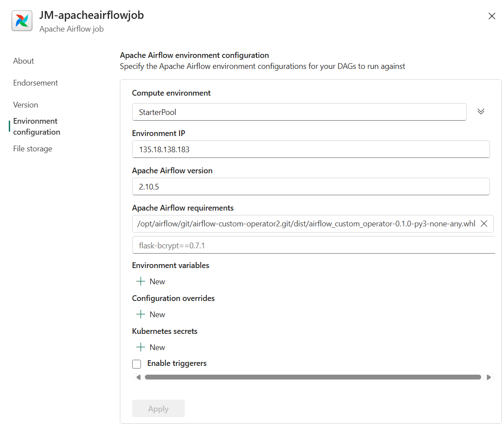

# Airflow Custom Livy Session Operator

This project provides a custom Apache Airflow operator, `CustomSessionLivyOperator`, designed to extend the functionality of Airflow workflows.

The existing LivyOperator uses the Livy batch API, but there are some scenarios where the Livy sessions API is required. One such scenario is submitting in-line Spark SQL.

This Livy Session Operator provides a simplified Operator for sending Spark SQL to a Microsoft Fabric instance.

## Overview

The `CustomSessionLivyOperator` allows users to define custom tasks within their Airflow DAGs, enabling more complex workflows tailored to specific needs.

## Installation

To install the custom operator, clone the repository and install the required dependencies:

```bash
git clone <repository-url>
cd airflow-custom-operator
pip install -r requirements.txt
```

## Usage

To use the `CustomSessionLivyOperator` in your Airflow DAG, you can import it as follows:

```python
from datetime import datetime
from airflow import DAG

 # Import from private package
from operators.livysessionsoperator import CustomSessionLivyOperator

# test dag
livy_spark = CustomSessionLivyOperator(
        task_id="livy_spark",
        fabric_conn_id = "fabric",
        workspace_id="YOUR_FABRIC_WORKSPACE_ID",
        item_id="YOUR_FABRIC_LAKEHOUSE_ID",
        command="spark.sql(\"SELECT * FROM lhJohn.green_tripdata_2022 where total_amount > 0\").show()",
        dag=dag,
    )
```

## Testing

Unit tests for the `CustomSessionLivyOperator` are located in the `tests` directory. You can run the tests using:

```bash
pytest tests/
```

## Building for the Package for Distribution
The package needs to be built and it is this package that the Airflow DAGs use:

```bash
python setup.py sdist bdist_wheel
```

## Use Inside Apache Airflow in Microsoft Fabric
To use this inside a Microsoft Fabric hosted Apache Airflow session, two things need to be done:

1. The source for the DAGs needs to be GitHub hosted.
2. The path to the packaged Operator needs to be added to the Apache Airflow requirements.

### Using a GitHub Repository
The source for all code for Airflow needs to point to a source code source. As this repository is in GitHub, this needs to be set. The Airflow configuration is read-only, so if the repository is public-faced, then no credentials are needed. For private repositories, credentials will be needed.


### Apache Airflow requirements
This is configured in the environment variables section and a path the the packaged version of the Operator needs to be added.
This follows a specific pattern as described in [Install a Private Package as a requirement in Apache Airflow job](https://learn.microsoft.com/en-us/fabric/data-factory/apache-airflow-jobs-install-private-package)


## License

This project is licensed under the MIT License. See the LICENSE file for details.
